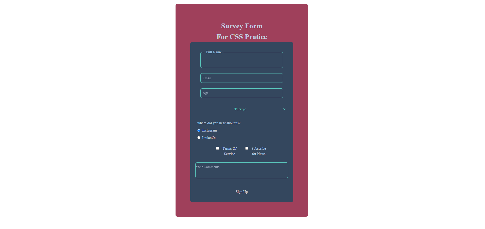

# 📋 Survey Form - CSS Practice Project

Modern ve şık bir anket formu tasarımı. Bu proje, HTML form elemanları ve CSS stil uygulamaları üzerinde pratik yapmak amacıyla geliştirilmiştir.



## 🎯 Proje Amacı

Bu proje, aşağıdaki konularda pratik yapmak için oluşturulmuştur:
- HTML5 form elemanları (input, select, textarea, radio, checkbox)
- Modern CSS teknikleri (Flexbox, Grid, Custom Properties)
- Form validasyonu
- Responsive tasarım prensipleri
- CSS pseudo-elementler ve pseudo-classlar

## ✨ Özellikler

- ✅ Tam duyarlı (responsive) tasarım
- ✅ Modern ve kullanıcı dostu arayüz
- ✅ Özel CSS renk değişkenleri
- ✅ Hover efektleri ve geçiş animasyonları
- ✅ Fieldset ve legend kullanımı
- ✅ Placeholder stillendirme
- ✅ Radio button ve checkbox özelleştirme
- ✅ Form elemanlarının tutarlı hizalanması

## 🛠️ Kullanılan Teknolojiler

- **HTML5** - Semantik yapı ve form elemanları
- **CSS3** - Modern stillendirme ve layout
  - Flexbox
  - CSS Grid
  - Custom Properties (CSS Variables)
  - Pseudo-elements (::before, ::after)
  - Transitions

## 📁 Proje Yapısı

```
Task 2-forms/
│
├── index.html          # Ana HTML dosyası
├── css/
│   └── style.css       # Tüm stil tanımlamaları
├── img/
│   └── ana-ekran.png   # Proje ekran görüntüsü
└── README.md           # Proje dokümantasyonu
```

## 🎨 Renk Paleti

```css
--clr--font: #C2CFE0;        /* Açık mavi-gri (Metin rengi) */
--clr--border: #5BCBBF;      /* Turkuaz (Border ve vurgu rengi) */
--clr--background: #9F405B;  /* Koyu pembe-mor (Arka plan) */
--clr--div: #34475E;         /* Koyu mavi-gri (Form arka planı) */
```

## 📋 Form Elemanları

1. **Text Input** - Full Name (Fieldset ile çerçevelenmiş)
2. **Email Input** - E-posta adresi
3. **Number Input** - Yaş bilgisi
4. **Select Dropdown** - Ülke seçimi
5. **Radio Buttons** - Bilgi kaynağı seçimi
6. **Checkboxes** - Kullanım şartları ve haber bülteni
7. **Textarea** - Yorumlar
8. **Submit Button** - Form gönderimi

## 🚀 Kurulum ve Kullanım

1. Projeyi klonlayın veya indirin
2. `index.html` dosyasını tarayıcınızda açın
3. Formu doldurup test edin

```bash
# Proje dizinine gidin
cd "Task 2-forms"

# Herhangi bir canlı sunucu ile açın veya doğrudan tarayıcıda açın
```

## 💡 CSS Teknikleri

### Custom Properties (CSS Variables)
```css
:root {
    --clr--font: #C2CFE0;
    --clr--border: #5BCBBF;
}
```

### Flexbox Layout
```css
.form__input-radio {
    display: flex;
    flex-direction: column;
    align-items: flex-start;
}
```

### CSS Grid
```css
.form__input-checkbox label {
    display: grid;
    grid-template-columns: auto 1fr;
}
```

### Transitions
```css
.form__button button {
    transition: background-color 0.3s ease, color 0.3s ease;
}
```


## 🎓 Öğrenilen Konular

- Form elemanlarının semantik kullanımı
- CSS reset ve normalize teknikleri
- Modern CSS layout teknikleri
- Pseudo-element kullanımı
- Form validasyonu ve erişilebilirlik
- Renk uyumu ve tipografi


Bu proje **Patika+ Front-end Week 2** ödevinin bir parçası olarak geliştirilmiştir.

---

⭐ Projeyi beğendiyseniz yıldız vermeyi unutmayın!
