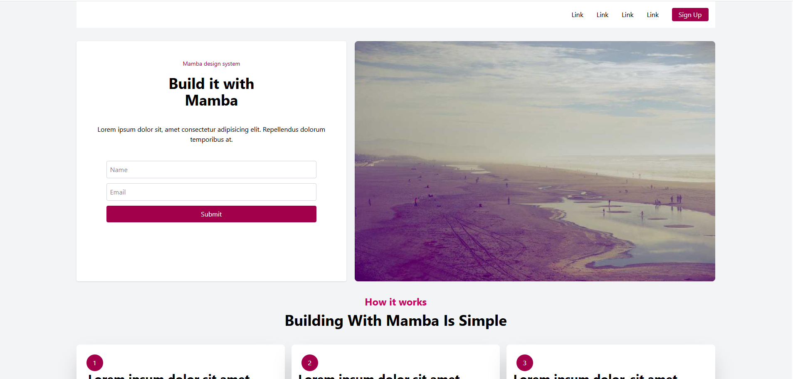

# Tailwind Landing Page – Mamba

Bu depo, Patika Front-end eğitiminin Tailwind CSS pratik ödevi için hazırlanan statik bir landing page içerir. Proje yalnızca masaüstü düzeni hedefler; responsive uyarlamalar kapsam dışındadır.

## Özellikler

- Tailwind CSS ile kart yapısı, form ve grid temelli bileşenler.
- Lorem ipsum içerikleriyle demo odaklı düzen.
- Picsum üzerinden örnek görsellerle görsel yerleşim denemesi.

## Kullanılan Teknolojiler

- HTML5
- Tailwind CSS 

## Kurulum

1. Depoyu klonlayın veya ZIP olarak indirin.
2. `dist/output.css` dosyasının mevcut olduğundan emin olun.
3. `dist/index.html` dosyasını tarayıcıda açarak projeyi görüntüleyin.

## Proje Yapısı

- `dist/index.html` – Tailwind sınıflarıyla hazırlanmış ana sayfa.
- `dist/output.css` – Tailwind çıkış dosyası.
- `img/` – Proje ekran görüntüleri.

## Ekran Görüntüleri

  
  
  

## Katkı

Bu proje eğitim amacıyla oluşturulduğundan katkı talepleri beklenmemektedir; yine de fork ederek kendi varyasyonlarınızı deneyebilirsiniz.
