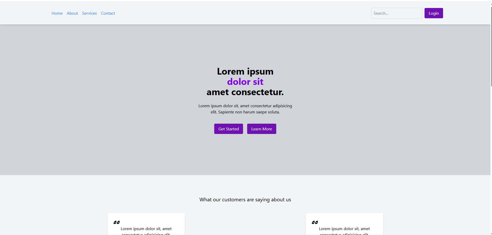
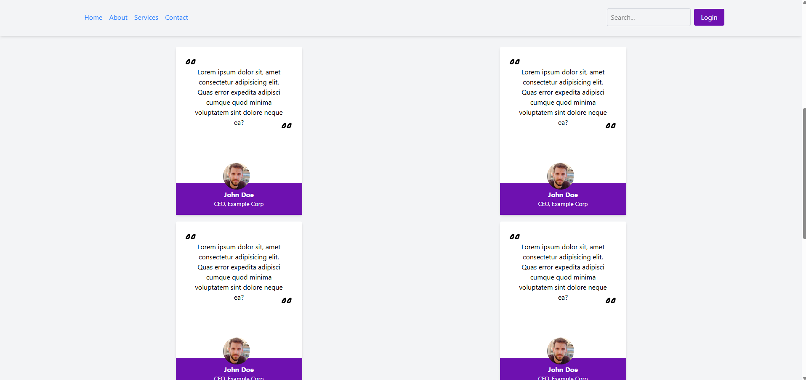
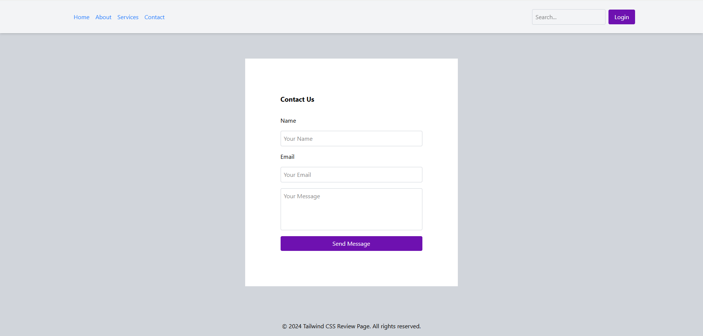

# TailwindCSS Review Page

Bu proje, Patika Front-end eğitimi kapsamında Tailwind CSS pratiği için hazırlanmış statik bir inceleme sayfasıdır. Çalışma responsive öncelikli değildir; masaüstü düzeninde Tailwind sınıflarını uygulama amacı taşır.

## Özellikler

- Tailwind CSS ile oluşturulmuş kart, grid ve tipografi bileşenleri.
- Lorem ipsum içerikleriyle demo odaklı sayfa düzeni.
- Eğitim amaçlı yorum ve değerlendirme bölümleri.

## Kullanılan Teknolojiler

- HTML5
- Tailwind CSS (build çıktısı üzerinden)

## Kurulum

1. Depoyu klonlayın veya ZIP olarak indirin.
2. `dist/output.css` dahil Tailwind çıktılarının mevcut olduğundan emin olun.
3. Ana HTML dosyasını tarayıcıda açarak projeyi görüntüleyin.

## Proje Yapısı

- `index.html` – Tailwind ile stillenmiş ana sayfa.
- `dist/` – Derlenen Tailwind CSS dosyaları.
- `img/` – Sayfa ekran görüntüleri (varsa).

## Ekran Görüntüleri

  
  
  

## Katkı

Bu proje tamamen eğitim amaçlıdır. Kendi varyasyonlarınızı denemek için repo’yu fork’layabilirsiniz.
